# EngageIQ Module Dependencies

This document illustrates the dependencies between modules in the EngageIQ Chrome Extension, providing a visual representation of the refactored modular architecture.

## Main Components and Their Dependencies

```mermaid
graph TD
    %% Main Files
    background[background.js]:::main
    content[content_script.js]:::main
    popup[popup.js]:::main
    options[options.js]:::main
    
    %% Models
    geminiModel[models/gemini-model.js]:::model
    openaiModel[models/openai-model.js]:::model
    
    %% Services
    apiService[services/api-service.js]:::service
    apiProvider[services/api-provider.js]:::service
    commentGen[services/comment-generation.js]:::service
    messageService[services/message-service.js]:::service
    popupMessageService[services/popup-message-service.js]:::service
    postExtractor[services/post-extractor.js]:::service
    regenService[services/regeneration-service.js]:::service
    
    %% UI Components
    accordionCtrl[ui/accordion-controller.js]:::ui
    buttonInjector[ui/button-injector.js]:::ui
    errorHandler[ui/error-handler.js]:::ui
    iframeManager[ui/iframe-manager.js]:::ui
    modelIndicator[ui/model-indicator.js]:::ui
    stateController[ui/state-controller.js]:::ui
    suggestionRenderer[ui/suggestion-renderer.js]:::ui
    
    %% Utils
    storageUtils[utils/storage-utils.js]:::util
    connectionMonitor[utils/connection-monitor.js]:::util
    
    %% Background dependencies
    background --> geminiModel
    background --> openaiModel
    background --> apiService
    background --> apiProvider
    background --> commentGen
    background --> regenService
    background --> storageUtils
    background --> messageService
    
    %% Content script dependencies
    content --> buttonInjector
    content --> iframeManager
    content --> postExtractor
    content --> messageService
    content --> connectionMonitor
    
    %% Popup dependencies
    popup --> suggestionRenderer
    popup --> errorHandler
    popup --> accordionCtrl
    popup --> popupMessageService
    popup --> modelIndicator
    popup --> stateController
    
    %% Options dependencies
    options --> storageUtils
    options --> geminiModel
    options --> openaiModel
    
    %% Service interdependencies
    apiService --> geminiModel
    apiService --> openaiModel
    apiProvider --> apiService
    commentGen --> apiProvider
    regenService --> apiProvider
    regenService --> commentGen
    popupMessageService --> messageService
    
    %% UI interdependencies
    suggestionRenderer --> modelIndicator
    suggestionRenderer --> errorHandler
    buttonInjector --> iframeManager
    
    classDef main fill:#f9f,stroke:#333,stroke-width:2px;
    classDef model fill:#fcf,stroke:#333,stroke-width:1px;
    classDef service fill:#bbf,stroke:#333,stroke-width:1px;
    classDef ui fill:#dfb,stroke:#333,stroke-width:1px;
    classDef util fill:#fdb,stroke:#333,stroke-width:1px;
```

## Module Types

- **Main Files** (Pink): Core files that initialize and coordinate the application
- **Models** (Light Pink): Data models and API configurations
- **Services** (Blue): Business logic and data processing
- **UI Components** (Green): User interface elements and interactions
- **Utilities** (Orange): Helper functions and shared utilities

## Notes on Module Dependencies

- The application follows a modular architecture to maintain separation of concerns
- Each module is limited to 200 lines of code for maintainability
- Main files act as orchestrators, importing and coordinating modules
- Dependencies flow primarily from main files to specialized modules
- Some inter-module dependencies exist where specialized functionality is required

## Multi-Model Support Architecture

- The extension now supports both Google's Gemini and OpenAI models
- The `api-provider.js` service acts as a facade that routes requests to the appropriate model implementation
- Model-specific implementations are contained in their respective model files:
  - `gemini-model.js`: Handles all Gemini API interactions
  - `openai-model.js`: Handles all OpenAI API interactions including local LLM support via LM Studio
- The `storage-utils.js` module has been extended to store and retrieve the selected model provider
- The `model-indicator.js` UI component displays the currently active model
- The `connection-monitor.js` utility monitors API connectivity status

## Best Practices for Module Development

1. When adding new functionality, create or extend modules rather than main files
2. Maintain the 200-line limit for all JavaScript files
3. Use ES6 import/export syntax for all module interactions
4. Keep dependencies as minimal as possible to reduce coupling
5. Always prefix console.log statements with 'EngageIQ: ' for filtering in browser console
6. Each module should have a clear, single responsibility
