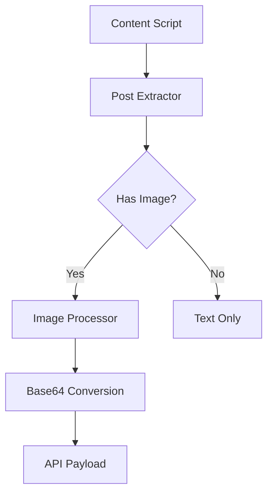
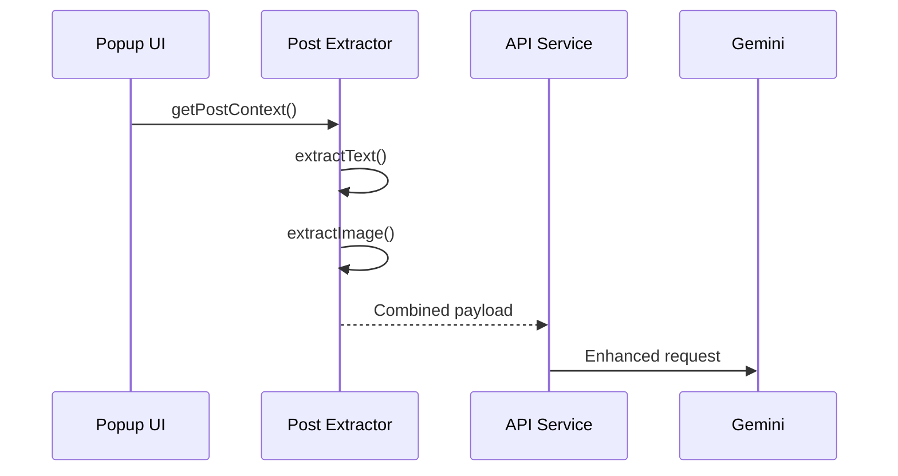

# Image Context Integration - Technical Design
*Version 1.0*

## Architecture Overview


## Component Modifications

### 1. Post Extractor Service
```javascript
// New methods:
class PostExtractor {
  +getImageContext(): {
    base64: string | null,
    error?: string
  }
}
```

### 2. API Service
```javascript
// Payload changes:
interface GeminiPayload {
  text_context: string;
  image_context?: {  // New optional field
    base64: string;
    dimensions: { w: number, h: number };
  };
}
```

## Sequence Diagram


## Error Handling
| Scenario | Action |
|----------|--------|
| Image >5MB | Skip silently |
| CORS issue | Log warning |
| Canvas error | Fallback to text |

## Performance Budget
- Max added latency: 300ms
- Memory limit: 50MB heap
- Payload cap: 6MB (base64)
