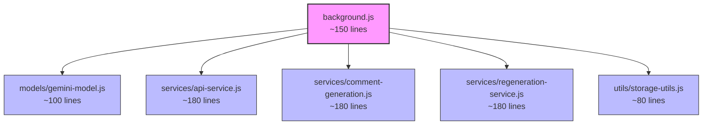
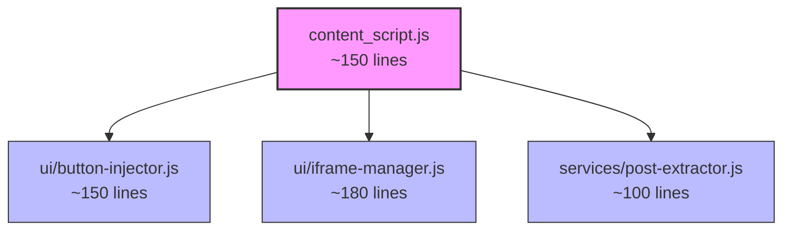
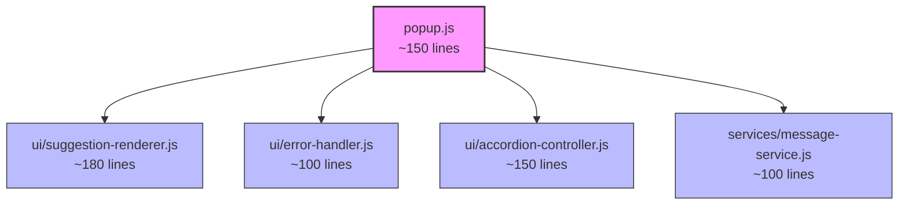

# JavaScript Refactoring Approach: 200-Line Limit Implementation

## Overview

This document outlines our approach to refactoring the EngageIQ Chrome Extension's JavaScript files to adhere to a 200-line limit per file. This refactoring will improve code maintainability, readability, and organization while preserving all existing functionality.

## Current State Analysis

Our analysis identified the following JavaScript files that exceed the 200-line limit:

| File | Current Line Count | Excess Lines | Status |
|------|-------------------|--------------|--------|
| background.js | ~864 lines | ~664 lines | Needs refactoring |
| content_script.js | ~614 lines | ~414 lines | Needs refactoring |
| popup.js | ~769 lines | ~569 lines | Needs refactoring |
| manifest_check.js | ~125 lines | 0 lines | Within limit |
| options.js | ~100 lines | 0 lines | Within limit |

## Refactoring Strategy

We will implement a modular approach, breaking down each large file into smaller, focused modules that follow the single responsibility principle. Each module will be limited to a maximum of 200 lines of code.

### 1. Directory Structure

```mermaid
graph TD
    js[js/]
    background[background.js]
    content[content_script.js]
    popup[popup.js]
    options[options.js]
    manifest[manifest_check.js]
    
    models[models/]
    gemini[gemini-model.js]
    
    services[services/]
    api[api-service.js]
    comment[comment-generation.js]
    regen[regeneration-service.js]
    post[post-extractor.js]
    message[message-service.js]
    
    ui[ui/]
    button[button-injector.js]
    iframe[iframe-manager.js]
    suggestion[suggestion-renderer.js]
    error[error-handler.js]
    accordion[accordion-controller.js]
    
    utils[utils/]
    storage[storage-utils.js]
    
    js --> background
    js --> content
    js --> popup
    js --> options
    js --> manifest
    js --> models
    js --> services
    js --> ui
    js --> utils
    
    models --> gemini
    
    services --> api
    services --> comment
    services --> regen
    services --> post
    services --> message
    
    ui --> button
    ui --> iframe
    ui --> suggestion
    ui --> error
    ui --> accordion
    
    utils --> storage
```



### 2. Module Breakdown

#### 2.1 Background.js Refactoring



The background.js file will be split into the following modules:

1. **background.js** (main file, ~150 lines)
   - Core initialization
   - Message listener setup
   - Basic routing to appropriate service modules

2. **models/gemini-model.js** (~100 lines)
   - Model selection functionality
   - API endpoint construction
   - Model validation

3. **services/api-service.js** (~180 lines)
   - API request handling
   - Response processing
   - Error handling

4. **services/comment-generation.js** (~180 lines)
   - Comment generation logic
   - Schema definitions
   - Response formatting

5. **services/regeneration-service.js** (~180 lines)
   - Comment regeneration functionality
   - Length adjustment logic

6. **utils/storage-utils.js** (~80 lines)
   - Storage operations
   - Settings management

#### 2.2 Content_script.js Refactoring



The content_script.js file will be split into:

1. **content_script.js** (main file, ~150 lines)
   - Core initialization
   - MutationObserver setup
   - Basic DOM operations

2. **ui/button-injector.js** (~150 lines)
   - Button creation and injection
   - Comment box processing

3. **ui/iframe-manager.js** (~180 lines)
   - Iframe creation and management
   - Message handling between iframe and content script

4. **services/post-extractor.js** (~100 lines)
   - Post content extraction
   - DOM traversal for content

#### 2.3 Popup.js Refactoring



The popup.js file will be split into:

1. **popup.js** (main file, ~150 lines)
   - Core initialization
   - Message handling setup
   - State management

2. **ui/suggestion-renderer.js** (~180 lines)
   - Suggestion display logic
   - Accordion management

3. **ui/error-handler.js** (~100 lines)
   - Error display
   - User-friendly error messages

4. **ui/accordion-controller.js** (~150 lines)
   - Accordion interaction logic
   - Button event handlers

5. **services/message-service.js** (~100 lines)
   - Message processing
   - Communication with content script

### 3. Implementation Approach

We will follow these steps to implement the refactoring:

1. **Create module files**: Create all necessary files according to the directory structure.

2. **Implement ES6 modules**: Use ES6 import/export syntax for module communication:
   ```javascript
   // In the module file
   export function myFunction() { ... }
   
   // In the main file
   import { myFunction } from './module-file.js';
   ```

3. **Update manifest.json**: Ensure all new JS files are properly registered in the manifest.json file.

4. **Maintain consistent logging**: Follow the established pattern of prefixing all console.log statements with 'EngageIQ: '.

5. **Progressive implementation**: Refactor one file at a time, starting with the largest files, and test thoroughly after each refactoring.

6. **Documentation**: Update code documentation to reflect the new structure and module responsibilities.

### 4. Testing Strategy

For each refactored module:

1. **Unit testing**: Test each module in isolation to ensure it performs its specific functions correctly.

2. **Integration testing**: Test interactions between modules to ensure they communicate properly.

3. **End-to-end testing**: Test the complete workflow to ensure the refactored code maintains all existing functionality.

4. **Browser compatibility testing**: Verify functionality across supported browsers.

## Benefits of Refactoring

This refactoring approach offers several benefits:

1. **Improved maintainability**: Smaller, focused files are easier to understand and maintain.

2. **Better organization**: Logical grouping of related functionality improves code navigation.

3. **Easier testing**: Isolated modules can be tested independently.

4. **Improved performance**: Smaller files may load faster and improve runtime performance.

5. **Better collaboration**: Team members can work on different modules simultaneously without conflicts.

6. **Scalability**: The modular structure makes it easier to add new features in the future.

## Timeline and Milestones

1. **Week 1**: Create directory structure and refactor background.js
2. **Week 2**: Refactor content_script.js
3. **Week 3**: Refactor popup.js
4. **Week 4**: Testing, bug fixing, and documentation

## Conclusion

By implementing this refactoring approach, we will significantly improve the maintainability and organization of the EngageIQ codebase while adhering to the 200-line limit requirement. The modular structure will make future development more efficient and reduce the risk of introducing bugs when making changes.
